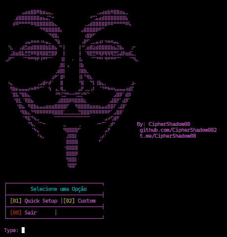

# 🕵️‍♂️ HTW Payload Generator - CipherShadow08



## 📌 Descrição do Sistema
Ferramenta Python para geração automatizada de payloads do Metasploit com:

🔹 **⚡ Configuração em 1-clique** (Quick Setup)  
🔹 **🎨 Interface colorida** intuitiva  
🔹 **🌐 Suporte a Ngrok** integrado  
🔹 **📦 Geração multi-plataforma** (Android/Windows)  

## 🛠️ Funcionalidades Principais
- 🤖 Auto-configuração do listener no Metasploit
- 🔄 Rotação automática de portas
- 📁 Gerenciamento inteligente de payloads
- 🧹 Limpeza de rastros após execução

💰 Suporte personalizado via Telegram: [@CipherShadow08](https://t.me/CipherShadow08)

## ⚙️ Requisitos Técnicos
```bash
# Requisitos Mínimos
• 🐍 Python 3.6+
• ⚡ Metasploit Framework 
• 💾 500MB de espaço livre
• 📶 Conexão TCP/IP estável
